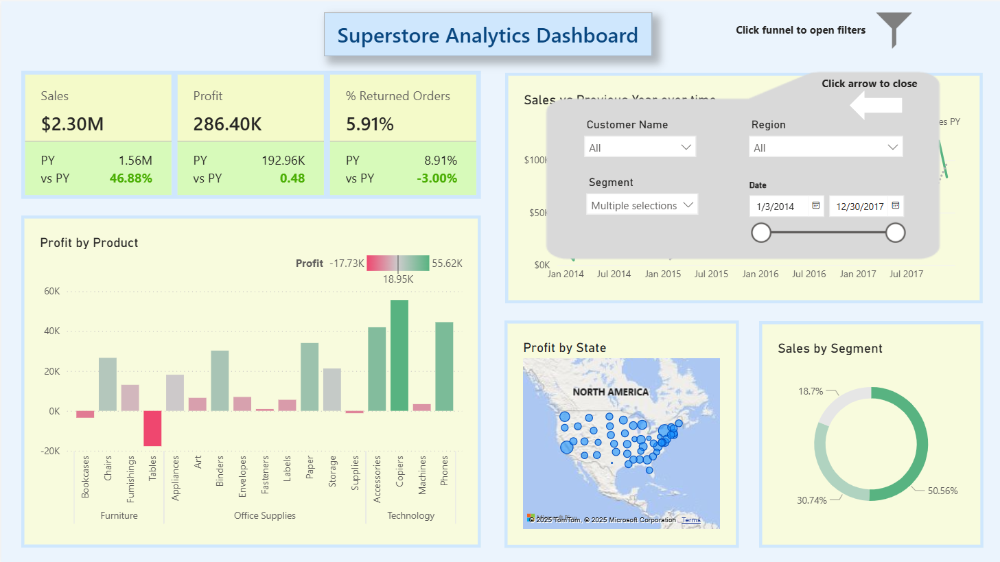

# Power BI Superstore Dashboard

## 📖 Project Overview
This project showcases an **interactive Power BI dashboard** built with the **Superstore sample dataset**.  
It provides insights into **sales, profit, returns, and customer behavior** across products, regions, and time.  
The dashboard includes clear KPIs, year-over-year comparisons, and interactive filters to help decision-makers quickly identify trends, growth drivers, and problem areas.  

⚠️ **Note:** The live Power BI dashboard is hosted in a private workspace and cannot be shared publicly.  
This repository includes a PDF snapshot and screenshots that fully demonstrate the design, KPIs, and interactivity of the dashboard.

---

## 📊 Key Features
- **KPI Cards** – Track Sales, Profit, and % Returned Orders with YOY trends.  
- **Trend Analysis** – Sales vs Previous Year over time.  
- **Profit by Product** – Category-level breakdown to identify top/bottom performers.  
- **Profit by State** – Regional map visualization.  
- **Sales by Segment** – Customer segment distribution.  
- **Interactive Filters** – Funnel slicers for Customer, Region, Segment, and Date.  

---

## 🛠️ Tools & Skills
- Power BI – dashboard design and interactivity  
- Data Visualization – clear, business-focused visuals  
- Business Intelligence (BI) – transforming raw data into insights  
- KPI & Performance Tracking  

---

## 📂 Repository Contents
- `Superstore_Analytics_PBI_Dashboard.pdf` → Exported PDF snapshot of the main dashboard.  
- `Superstore_Analytics_PBI_Dashboard2.png` → Screenshot of the dashboard with filters panel open.  

---

## 📸 Screenshots

### Main Dashboard (PDF Snapshot)
[View PDF of Main Dashboard](Superstore_Analytics_PBI_Dashboard.pdf)

### Dashboard with Filters

---

## 🚀 Business Value
This dashboard enables managers and analysts to:  
- Monitor KPIs like Sales, Profit, and Returns.  
- Compare year-over-year performance.  
- Identify profitable products and underperformers.  
- Explore customer segments and regional patterns.  
- Make faster, data-driven decisions.  

---

📌 *This dashboard uses the Superstore sample dataset. No organizational or proprietary data is included.*
